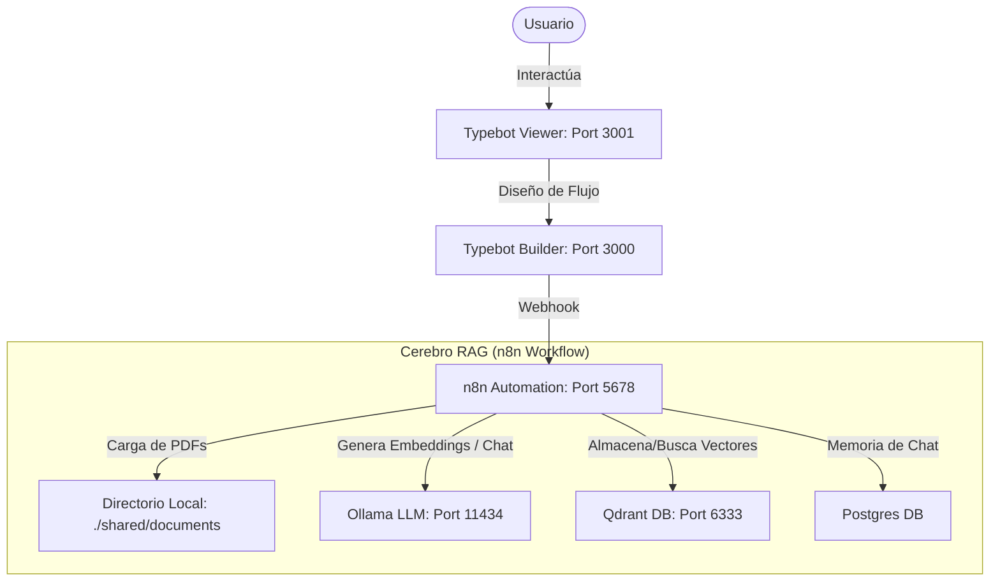

# 🤖 Stack RAG Local: n8n + Ollama + Qdrant + Typebot

Este proyecto implementa una infraestructura completa de **RAG (Retrieval-Augmented Generation)** que se ejecuta de forma 100% local. Está diseñado específicamente para permitir a **PyMes (Pequeñas y Medianas Empresas)** mejorar sus controles de ciberseguridad mediante un asistente inteligente que se alimenta de guías especializadas y datos internos de la organización.

---

## 🛡️ Propósito y Beneficios Clave

### 1. Ciberseguridad para PyMes a tu Medida
El sistema está optimizado para tomar como data de entrada:
* **Nuestra Guía de Controles de Ciberseguridad para PyMes**: El marco base de referencia con directrices claras y accesibles para proteger tu negocio.
* **Información interna de tu empresa**: Políticas de TI existentes, inventarios de activos (software/hardware), diagramas de red o respuestas previas a auditorías.
* **Resultado**: Un chatbot consultor que entiende el contexto de ciberseguridad y las particularidades de tu empresa, guiándote paso a paso en la mejora de tus defensas sin abrumarte con lenguaje sumamente técnico.

### 2. Privacidad y Seguridad Absoluta (Zero-Cloud Leak)
> [!IMPORTANT]
> **Tus datos nunca salen de tu empresa.**
> A diferencia de las soluciones basadas en OpenAI (ChatGPT), Anthropic (Claude) o Copilot, este stack ejecuta todo el procesamiento y almacenamiento de forma **local**:
> * **Sin APIs de terceros**: Las preguntas del chat, las contraseñas, los inventarios y los archivos PDF se procesan en tu propia infraestructura.
> * **Cumplimiento y Confidencialidad**: Ideal para empresas que deben cumplir con regulaciones estrictas de protección de datos o que manejan información comercial altamente sensible que no puede ser compartida en la nube.

---

## 🔄 Personalización y Cambio de Modelos de IA

Una de las mayores ventajas de este stack es su flexibilidad. Puedes cambiar los modelos de IA según la capacidad de tu hardware y tus necesidades de precisión:

### ¿Cómo cambiar los modelos en Ollama?
Puedes buscar cualquier modelo compatible en la [Biblioteca de Modelos de Ollama](https://ollama.com/library). Por ejemplo:
* **Modelos de Chat alternativos**:
  * `gemma2:9b` o `llama3:8b`: Si tienes una máquina/servidor potente (con GPU dedicada) y buscas respuestas de mayor calidad y razonamiento.
  * `phi3` o `qwen2.5:3b`: Si buscas mayor velocidad o tienes recursos de hardware muy limitados.
* **Descarga del nuevo modelo**:
  Ejecuta en tu terminal el comando de descarga reemplazando el nombre del modelo:
  ```bash
  docker exec -it ollama-rag-v2 ollama pull gemma2:9b
  ```

### ¿Cómo configurarlo en el flujo de n8n?
1. Entra a tu panel de **n8n** ([http://localhost:5678](http://localhost:5678)).
2. Abre el workflow importado.
3. Busca los nodos de Ollama:
   * **Ollama Chat Model** (conectado al agente de IA).
   * **Embeddings Ollama / Embeddings Ollama1** (utilizado para procesar los PDFs).
4. Cambia el campo **Model** escribiendo exactamente el nombre del nuevo modelo que descargaste en el paso anterior (por ejemplo, `gemma2:9b`).
5. Guarda los cambios en n8n (`Save`). El sistema comenzará a usar el nuevo modelo automáticamente.

---

## 📂 Variantes de Documentos que puedes ingresar

Para alimentar la base de datos de conocimiento en Qdrant, puedes colocar múltiples tipos de archivos y formatos en la carpeta `shared/documents/`:

* **Guías de Controles**: Normas de ciberseguridad, frameworks (NIST, ISO 27001 simplificado) y la guía específica para PyMes.
* **Políticas Internas**: Manuales de uso de contraseñas, políticas de trabajo remoto, procesos de onboarding/offboarding de empleados.
* **Archivos Técnicos**: Reportes de escaneo de vulnerabilidades, inventario de computadoras y servidores, configuraciones de red en texto plano.
* **Hojas de Ruta**: Planes de contingencia frente a incidentes, listas de contactos de emergencia.

---

## 🏗️ Arquitectura del Sistema

El stack está compuesto por los siguientes servicios integrados mediante **Docker Compose**:



### Componentes Clave:
1. **[Typebot](https://typebot.io)**: La interfaz del chat para el usuario (`typebot-viewer` en puerto `3001`) y el panel visual de diseño (`typebot-builder` en puerto `3000`).
2. **[n8n](https://n8n.io)**: Orquestador y motor principal del flujo RAG. Recibe el input de Typebot, busca información relevante, consulta al LLM y devuelve la respuesta.
3. **[Ollama](https://ollama.com)**: Servidor local de Modelos de Lenguaje (LLMs). Ejecuta los modelos de inteligencia artificial para responder preguntas y generar embeddings.
4. **[Qdrant](https://qdrant.tech)**: Base de datos vectorial donde se indexan los documentos PDF fragmentados para realizar búsquedas semánticas rápidas.
5. **PostgreSQL**: Base de datos relacional que guarda el historial de las conversaciones para que el bot recuerde el contexto.

---

## 🛠️ Requisitos Previos

Antes de comenzar, asegúrate de tener instalado:
* **Docker** y **Docker Compose**.
* Suficiente espacio en disco y memoria RAM (se recomiendan mínimo 8GB de RAM libres para ejecutar los modelos locales fluidamente).

---

## 🚀 Guía de Instalación Paso a Paso

### 1. Clonar el repositorio y preparar carpetas
Copia los archivos a tu servidor o máquina local. El sistema requiere que existan ciertas carpetas para los archivos compartidos. Crea la estructura ejecutando en tu terminal:

```bash
mkdir -p shared/documents rag-data
```
* Coloca en la carpeta `shared/documents` todos los archivos **PDF** que quieras que tu bot aprenda.

### 2. Configurar las variables de entorno
Copia el archivo de plantilla `.env.example` y renombralo a `.env`:

```bash
cp .env.example .env
```

Abre el archivo `.env` con un editor de texto y define contraseñas seguras y claves aleatorias donde se te indique. Si estás corriendo el proyecto localmente, los valores por defecto y puertos sugeridos van a funcionar sin problemas.

### 3. Iniciar el Stack con Docker
Inicia todos los contenedores en segundo plano:

```bash
docker compose up -d
```

Verifica que todos los servicios estén corriendo:
```bash
docker compose ps
```

---

## 🧠 Configuración de Ollama (Modelos IA)

El flujo de n8n requiere dos modelos en Ollama. Debes descargarlos en el contenedor ejecutando:

1. **Modelo de Lenguaje (Chat)**: `llama3.2` (ligero y veloz)
   ```bash
   docker exec -it ollama-rag-v2 ollama pull llama3.2
   ```

2. **Modelo de Embeddings (Vectores)**: `nomic-embed-text-v2-moe` (para entender los documentos)
   ```bash
   docker exec -it ollama-rag-v2 ollama pull nomic-embed-text-v2-moe:latest
   ```

---

## 🔌 Configuración en n8n

1. Entra a **n8n** en tu navegador: [http://localhost:5678](http://localhost:5678).
2. Crea tu cuenta inicial si es la primera vez que ingresas.
3. Importa el flujo de trabajo:
   * Ve a **Workflows** -> **Add Workflow** (o crea uno nuevo vacío).
   * En la esquina superior derecha, haz clic en los tres puntos (`...`) y selecciona **Import from File**.
   * Elige el archivo [`rag-stack-tfi-v5.json`](rag-tfi/archivo-n8n/rag-stack-tfi-v5.json) ubicado en la carpeta `archivo-n8n/`.
4. **Configurar Credenciales** en n8n:
   * Al importar el flujo, n8n te pedirá configurar o vincular las credenciales de:
     * **Qdrant**: Host: `qdrant`, Puerto: `6333` (sin API key en local).
     * **Ollama**: Host/URL: `http://ollama:11434`.
     * **Postgres (Chat Memory)**: Host: `postgres`, Usuario: El configurado en tu `.env` (`POSTGRES_USER`), Contraseña: El configurado en tu `.env` (`POSTGRES_PASSWORD`), Base de datos: `n8n_db`.

### 📂 Indexar Documentos
1. Coloca tus archivos `.pdf` en la carpeta `./shared/documents/` de tu máquina.
2. Abre el workflow importado en n8n.
3. Haz clic en la primera rama del flujo llamada **Manual Trigger** y presiona **Execute workflow** (o haz clic en el nodo "Read/Write Files from Disk").
4. Esto leerá tus PDFs, generará los vectores de texto y los guardará en la colección `archivos_tfi` en Qdrant. ¡Tu base de datos de conocimiento ya tiene la información cargada!

---

## 💬 Configuración en Typebot

1. Abre **Typebot Builder**: [http://localhost:3000](http://localhost:3000).
2. Regístrate/inicia sesión (puedes ver la bandeja de entrada de correos de prueba en **Mailpit** en [http://localhost:8025](http://localhost:8025) si el flujo requiere confirmación de email).
3. Importa la plantilla del bot:
   * Crea un nuevo chatbot seleccionando **Import a file**.
   * Selecciona el archivo [`typebot-export-my-typebot-g6eejrx.json`](rag-tfi/archivo-typebot/typebot-export-my-typebot-g6eejrx.json) que se encuentra en la carpeta `archivo-typebot/`.
4. Conectar Typebot con n8n:
   * Abre el nodo del bot importado. Verás un bloque de tipo **Webhook** que realiza una petición `POST` HTTP.
   * Ve a n8n, abre el nodo **Webhook** (el trigger del chat) y copia la **Production URL** (o Test URL si estás haciendo pruebas).
   * En Typebot, pega esta URL en el campo URL del bloque Webhook. 
   * *Nota en Docker*: Como los contenedores se comunican internamente, puedes usar la dirección de red interna de Docker: `http://n8n-rag-v2:5678/webhook/typebot` en lugar de `localhost`.
5. Publica el bot haciendo clic en **Publish** en la esquina superior derecha.

---

## 🎮 Probar el Chatbot

Una vez configurado y publicado:
1. Abre **Typebot Viewer** o dale a **Preview** en el Builder.
2. Escribe una pregunta al chat basada en los PDFs que colocaste en la carpeta `shared/documents`.
3. El agente de IA responderá basándose estrictamente en la información de tus documentos, recordando los mensajes anteriores gracias a la persistencia en PostgreSQL.
